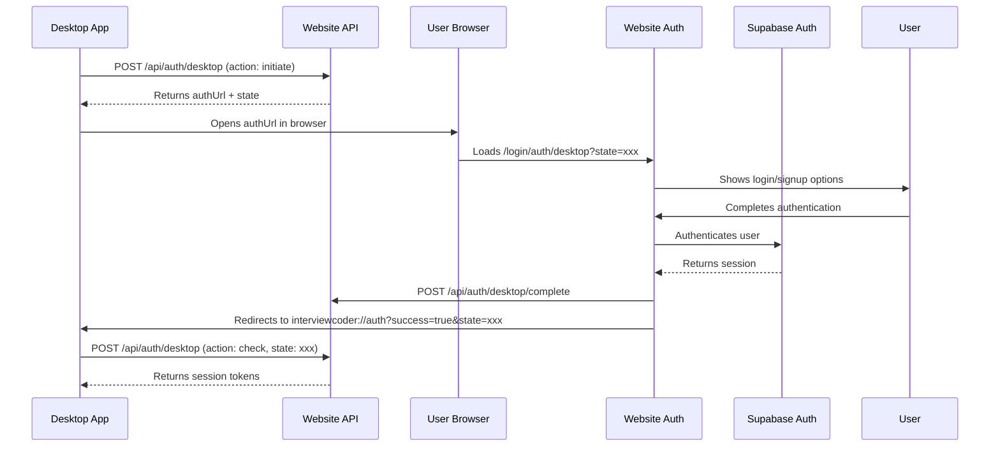

# Desktop App Authentication Setup Guide

This guide explains how to implement authentication for your desktop application using the website's authentication system. The desktop app will redirect users to the website for login, then receive authentication tokens back via a custom URL scheme.

## ✅ Website Setup Complete

Your website is now fully configured for desktop app authentication with the following routes:
- **Desktop Auth Page**: `/login/auth/desktop` - Main authentication page for desktop users
- **OAuth Callback**: `/login/auth/desktop/callback` - Handles OAuth redirects
- **API Endpoints**: `/api/auth/desktop` - Handles authentication flow
- **Environment Variables**: All necessary env vars are configured

## 🔄 Authentication Flow Overview



## 🌐 Website Implementation (Already Complete)

The website now includes the following components for desktop app authentication:

### API Endpoints
- **`/api/auth/desktop`** - Handles desktop auth initiation and status checking
- **`/api/auth/desktop/complete`** - Stores session data for desktop app retrieval

### Pages
- **`/login/auth/desktop`** - Desktop authentication landing page
- **`/login/auth/desktop/callback`** - OAuth callback handler for desktop flows

### Features
- ✅ Secure state parameter generation for CSRF protection
- ✅ Session storage and retrieval system
- ✅ OAuth integration (Google/GitHub) with desktop support
- ✅ Custom URL scheme redirect (`interviewcoder://auth`)
- ✅ Automatic session cleanup (10-minute expiry)

## 🖥️ Desktop App Implementation

### 1. Register Custom URL Scheme

#### For Electron Apps:
```javascript
// In main.js or main process
const { app, protocol } = require('electron');

// Register the custom protocol
app.setAsDefaultProtocolClient('interviewcoder');

// Handle protocol URLs when app is already running
app.on('second-instance', (event, commandLine, workingDirectory) => {
  // Handle the protocol URL from commandLine
  const url = commandLine.find(arg => arg.startsWith('interviewcoder://'));
  if (url) {
    handleAuthCallback(url);
  }
});

// Handle protocol URLs when app is starting
app.on('ready', () => {
  // Check if app was opened with a protocol URL
  if (process.argv.length >= 2) {
    const url = process.argv.find(arg => arg.startsWith('interviewcoder://'));
    if (url) {
      handleAuthCallback(url);
    }
  }
});
```

#### For Tauri Apps:
```rust
// In src-tauri/src/main.rs
use tauri::Manager;

#[tauri::command]
fn handle_deep_link(url: String) {
    // Handle the deep link URL
    println!("Received deep link: {}", url);
}

fn main() {
    tauri::Builder::default()
        .plugin(tauri_plugin_deep_link::init())
        .setup(|app| {
            // Register the custom protocol
            let handle = app.handle();
            tauri_plugin_deep_link::register("interviewcoder", move |request| {
                handle.emit_all("deep-link", request).unwrap();
            }).unwrap();
            Ok(())
        })
        .run(tauri::generate_context!())
        .expect("error while running tauri application");
}
```

### 2. Authentication Implementation

#### JavaScript/TypeScript Example:
```typescript
class DesktopAuth {
  private baseUrl = 'http://localhost:3000'; // Change to your website URL
  private authState: string | null = null;
  private authWindow: any = null;

  async initiateAuth(): Promise<boolean> {
    try {
      // Step 1: Initiate authentication with the website
      const response = await fetch(`${this.baseUrl}/api/auth/desktop`, {
        method: 'POST',
        headers: { 'Content-Type': 'application/json' },
        body: JSON.stringify({ action: 'initiate' })
      });

      const data = await response.json();
      
      if (!data.success) {
        throw new Error(data.error || 'Failed to initiate authentication');
      }

      this.authState = data.state;
      
      // Step 2: Open the auth URL in the user's browser
      this.openAuthUrl(data.authUrl);
      
      // Step 3: Start polling for authentication completion
      return this.pollForAuth();
      
    } catch (error) {
      console.error('Auth initiation failed:', error);
      return false;
    }
  }

  private openAuthUrl(url: string): void {
    // Open URL in default browser
    if (typeof window !== 'undefined' && window.require) {
      // Electron
      const { shell } = window.require('electron');
      shell.openExternal(url);
    } else {
      // Web or other environments
      window.open(url, '_blank');
    }
  }

  private async pollForAuth(): Promise<boolean> {
    if (!this.authState) return false;

    const maxAttempts = 60; // 5 minutes with 5-second intervals
    let attempts = 0;

    return new Promise((resolve) => {
      const checkAuth = async () => {
        try {
          const response = await fetch(`${this.baseUrl}/api/auth/desktop`, {
            method: 'POST',
            headers: { 'Content-Type': 'application/json' },
            body: JSON.stringify({ 
              action: 'check', 
              state: this.authState 
            })
          });

          const data = await response.json();
          
          if (data.success && data.authenticated) {
            // Authentication successful!
            this.handleAuthSuccess(data.session);
            resolve(true);
            return;
          }
          
          attempts++;
          if (attempts >= maxAttempts) {
            console.error('Authentication timeout');
            resolve(false);
            return;
          }
          
          // Continue polling
          setTimeout(checkAuth, 5000);
          
        } catch (error) {
          console.error('Auth check failed:', error);
          resolve(false);
        }
      };

      checkAuth();
    });
  }

  private handleAuthSuccess(session: any): void {
    // Store the session tokens securely
    localStorage.setItem('auth_session', JSON.stringify({
      access_token: session.access_token,
      refresh_token: session.refresh_token,
      expires_at: session.expires_at,
      user: session.user
    }));

    // Emit success event or update UI
    console.log('Authentication successful!', session.user);
  }

  // Handle deep link callback (called when custom URL scheme is triggered)
  handleDeepLink(url: string): void {
    const urlObj = new URL(url);
    const success = urlObj.searchParams.get('success');
    const state = urlObj.searchParams.get('state');

    if (success === 'true' && state === this.authState) {
      console.log('Deep link authentication confirmed');
      // The polling will handle the actual token retrieval
    }
  }

  // Get stored session
  getSession(): any | null {
    const stored = localStorage.getItem('auth_session');
    return stored ? JSON.parse(stored) : null;
  }

  // Check if user is authenticated
  isAuthenticated(): boolean {
    const session = this.getSession();
    if (!session) return false;
    
    // Check if token is expired
    const now = Date.now() / 1000;
    return session.expires_at > now;
  }

  // Sign out
  signOut(): void {
    localStorage.removeItem('auth_session');
    this.authState = null;
  }
}

// Usage example
const auth = new DesktopAuth();

// Initiate authentication
document.getElementById('loginBtn').addEventListener('click', async () => {
  const success = await auth.initiateAuth();
  if (success) {
    console.log('User authenticated successfully');
    // Update UI to show authenticated state
  } else {
    console.log('Authentication failed');
  }
});

// Handle deep link (register this with your app's deep link handler)
function handleAuthDeepLink(url: string) {
  auth.handleDeepLink(url);
}
```

### 3. Platform-Specific Setup

#### Windows (Electron)
```javascript
// In package.json
{
  "build": {
    "win": {
      "target": "nsis",
      "protocols": [
        {
          "name": "Interview Coder",
          "schemes": ["interviewcoder"]
        }
      ]
    }
  }
}
```

#### macOS (Electron)
```javascript
// In package.json
{
  "build": {
    "mac": {
      "protocols": [
        {
          "name": "Interview Coder",
          "schemes": ["interviewcoder"]
        }
      ]
    }
  }
}
```

#### Linux (Electron)
```javascript
// Create a .desktop file
[Desktop Entry]
Name=Interview Coder
Exec=/path/to/your/app %u
Icon=/path/to/your/icon
Type=Application
MimeType=x-scheme-handler/interviewcoder;
```

### 4. Security Considerations

#### Token Storage
```typescript
// Use secure storage for tokens
import keytar from 'keytar';

class SecureStorage {
  private serviceName = 'interview-coder';

  async storeSession(session: any): Promise<void> {
    await keytar.setPassword(this.serviceName, 'auth_session', JSON.stringify(session));
  }

  async getSession(): Promise<any | null> {
    const stored = await keytar.getPassword(this.serviceName, 'auth_session');
    return stored ? JSON.parse(stored) : null;
  }

  async clearSession(): Promise<void> {
    await keytar.deletePassword(this.serviceName, 'auth_session');
  }
}
```

#### Token Refresh
```typescript
class TokenManager {
  private baseUrl = 'http://localhost:3000';

  async refreshToken(refreshToken: string): Promise<any | null> {
    try {
      // Use Supabase client to refresh token
      const response = await fetch(`${this.baseUrl}/api/auth/refresh`, {
        method: 'POST',
        headers: { 'Content-Type': 'application/json' },
        body: JSON.stringify({ refresh_token: refreshToken })
      });

      const data = await response.json();
      return data.session || null;
    } catch (error) {
      console.error('Token refresh failed:', error);
      return null;
    }
  }

  async ensureValidToken(): Promise<any | null> {
    const session = await this.getSession();
    if (!session) return null;

    // Check if token is about to expire (refresh 5 minutes before expiry)
    const now = Date.now() / 1000;
    const expiresAt = session.expires_at;
    const refreshThreshold = 5 * 60; // 5 minutes

    if (expiresAt - now < refreshThreshold) {
      const newSession = await this.refreshToken(session.refresh_token);
      if (newSession) {
        await this.storeSession(newSession);
        return newSession;
      }
    }

    return session;
  }
}
```

## 🔧 Configuration

### Environment Variables
Create a `.env` file in your desktop app:

```env
# Website URL (change for production)
WEBSITE_URL=http://localhost:3000

# Custom URL scheme
URL_SCHEME=interviewcoder

# App name for secure storage
APP_NAME=interview-coder
```

### Production Configuration
For production, update the website URL:

```typescript
const config = {
  development: {
    websiteUrl: 'http://localhost:3000'
  },
  production: {
    websiteUrl: 'https://your-website.com'
  }
};

const baseUrl = process.env.NODE_ENV === 'production'
  ? config.production.websiteUrl
  : config.development.websiteUrl;
```

## 🧪 Testing

### Test the Authentication Flow

1. **Start your website** (ensure it's running on the configured URL)
2. **Build and run your desktop app**
3. **Click the login button** in your desktop app
4. **Verify browser opens** to the authentication page
5. **Complete authentication** on the website
6. **Verify redirect** back to desktop app
7. **Check session storage** in desktop app

### Debug Common Issues

#### Issue: Custom URL scheme not working
- **Windows**: Check registry entries for the protocol
- **macOS**: Verify Info.plist contains URL scheme
- **Linux**: Ensure .desktop file is properly installed

#### Issue: Authentication timeout
- Check network connectivity
- Verify website URL is correct
- Increase polling timeout if needed

#### Issue: Session not persisting
- Verify secure storage implementation
- Check token expiration handling
- Ensure proper session format

## 📱 Mobile App Support

The same authentication flow can be adapted for mobile apps:

### React Native
```javascript
import { Linking } from 'react-native';

// Open auth URL
Linking.openURL(authUrl);

// Handle deep link
Linking.addEventListener('url', handleDeepLink);
```

### Flutter
```dart
import 'package:url_launcher/url_launcher.dart';
import 'package:uni_links/uni_links.dart';

// Open auth URL
await launch(authUrl);

// Handle deep link
getLinksStream().listen((String link) {
  handleDeepLink(link);
});
```

## 🚀 Deployment

### Website Deployment
1. Deploy your website with the authentication endpoints
2. Configure environment variables for production
3. Update CORS settings if needed
4. Test authentication flow in production

### Desktop App Distribution
1. Build your desktop app with proper protocol registration
2. Sign your application (recommended for security)
3. Create installers that register the URL scheme
4. Test deep linking on target platforms

## 📋 Checklist

### Website Setup ✅
- [x] Desktop authentication API endpoints
- [x] Desktop authentication pages
- [x] OAuth integration with desktop support
- [x] Session management and cleanup
- [x] Custom URL scheme redirect

### Desktop App Setup (Your Implementation)
- [ ] Custom URL scheme registration
- [ ] Authentication class implementation
- [ ] Secure token storage
- [ ] Deep link handling
- [ ] Token refresh mechanism
- [ ] Error handling and retry logic
- [ ] UI integration
- [ ] Testing on target platforms

## 🔗 Additional Resources

- [Electron Protocol Registration](https://www.electronjs.org/docs/latest/tutorial/launch-app-from-url-in-another-app)
- [Tauri Deep Links](https://tauri.app/v1/guides/features/deep-link)
- [Supabase Auth Documentation](https://supabase.com/docs/guides/auth)
- [OAuth 2.0 Security Best Practices](https://datatracker.ietf.org/doc/html/draft-ietf-oauth-security-topics)

---

**Note**: This implementation provides a secure, production-ready authentication flow between your website and desktop application. The website components are already implemented and ready to use. Follow the desktop app implementation guide to complete the integration.
```
